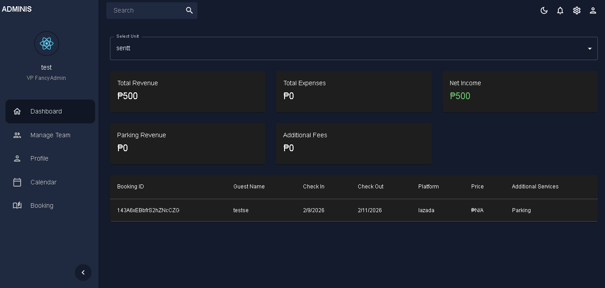
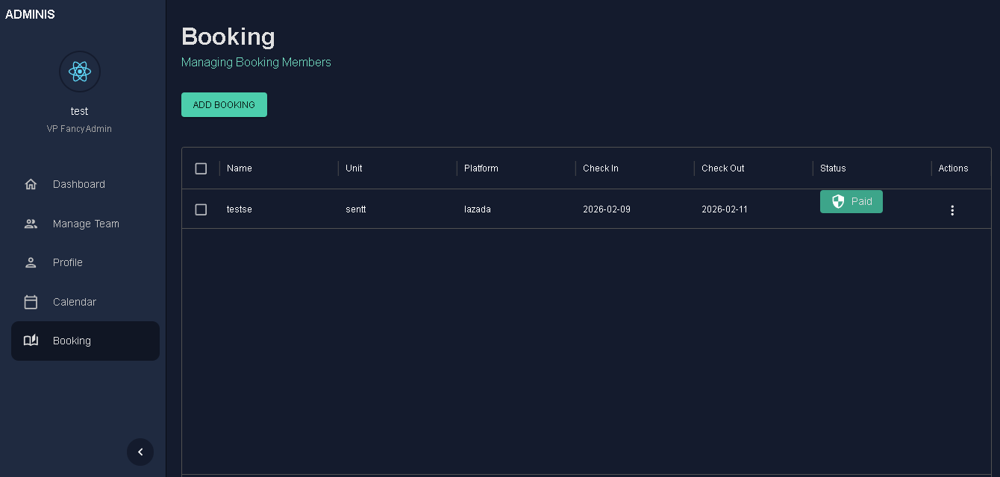
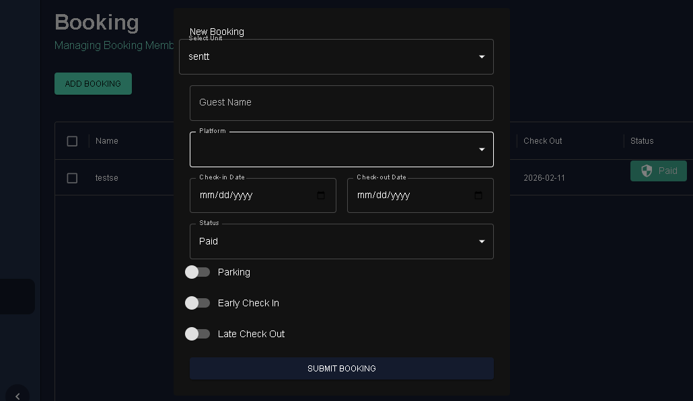
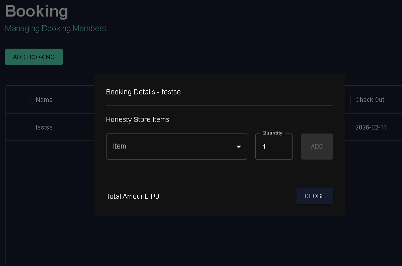
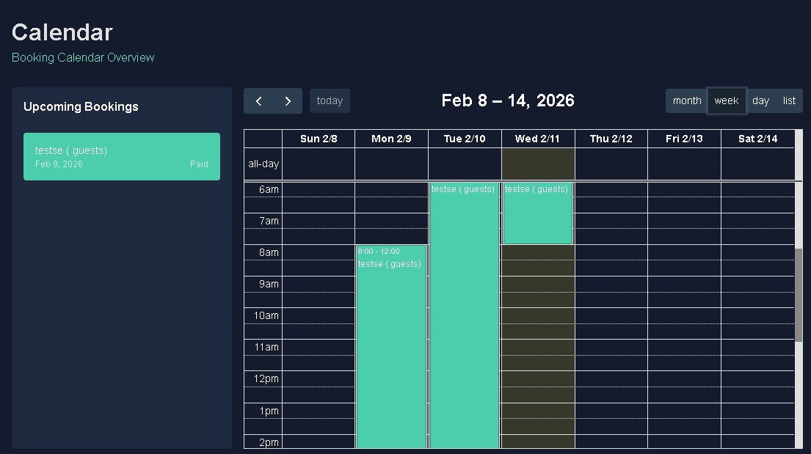
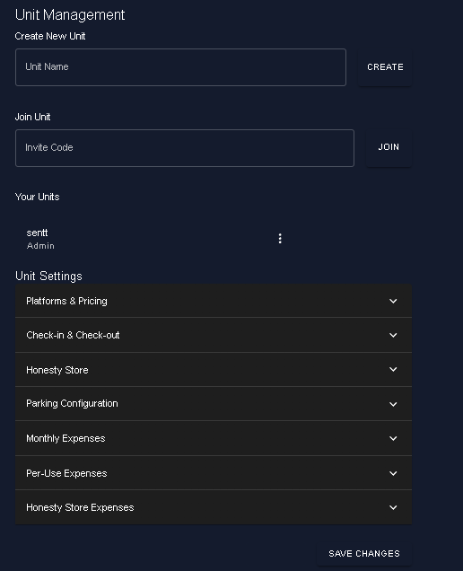

Personal Rental Finance App (PROTOTYPE) 

February, 2025

GitHub: https://github.com/senttt/my-app

Backend: Firebase (Realtime Database)

Frontend: HTML, CSS, JavaScript (React)

Database: Firebase Realtime Database

Server / Hosting: Firebase Hosting

Description:
A personal finance management prototype designed for Airbnb-style rental hosts to track income, expenses, and basic financial insights. The app demonstrates a working structure and flow for managing rental finances in a user-friendly interface.
My contributions:

-Designed and developed the entire application independently.

-Built the layout, navigation, and core functionality to manage financial records.

-Set up the project for online access and future feature expansion.

-Used the project as a hands-on way to practice end-to-end app development, from planning to deployment.

## 📸 Screenshots
| Feature | Preview |
|------|------|
| Dashoard |  |
| Booking Main |  |
| Add Booking |  |
| Booking Details |  |
| Calendar Month |  |
| Calendar Week |  |
| Calendar List |  |
| UnitConfig |  |

